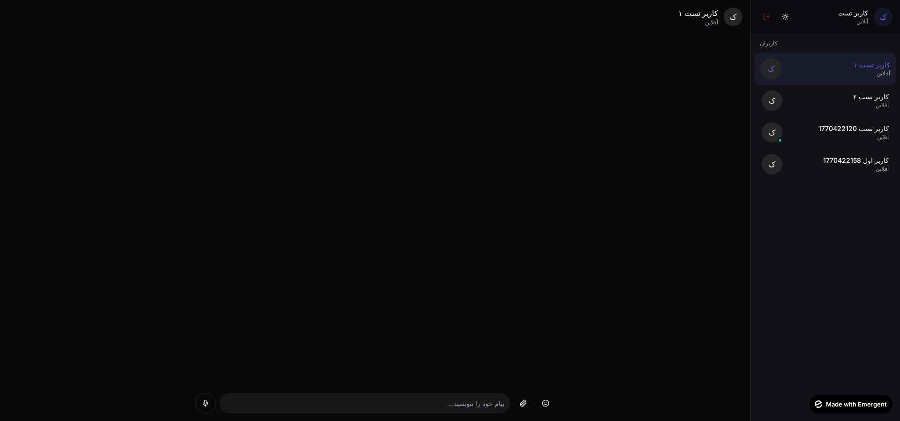

<div dir="rtl">

<p align="center">
  
</p>

<h1 align="center">🗨️ PicoChat</h1>

<p align="center">
  <strong>پیامرسان خصوصی، سریع و زیبا برای گفتگوی امن</strong>
</p>

<p align="center">
  <a href="#-امکانات">امکانات</a> •
  <a href="#-نصب-سریع">نصب سریع</a> •
  <a href="#-پیش-نیازها">پیش‌نیازها</a> •
  <a href="#-مستندات-api">API</a> •
  <a href="#-مشارکت">مشارکت</a>
</p>

<p align="center">
  
  
  
  
  
</p>

---

## 📸 پیش‌نمایش

<p align="center">
  
  
</p>

---

## ✨ امکانات

<table>
<tr>
<td width="50%">

### 🔐 احراز هویت امن
ثبت‌نام و ورود با نام کاربری و رمز عبور (JWT)

### ⚡ پیام‌رسانی آنی
ارسال و دریافت پیام لحظه‌ای با WebSocket

### 📷 ارسال مدیا
پشتیبانی از عکس، فیلم و فایل

### 🎤 پیام صوتی
ضبط و ارسال پیام صوتی

### 💬 ریپلای
پاسخ به پیام‌های قبلی

</td>
<td width="50%">

### 😊 ایموجی
انتخاب‌گر ایموجی با قابلیت جستجو

### 🌙 تم تاریک/روشن
قابلیت تغییر تم با ذخیره در مرورگر

### 🟢 وضعیت آنلاین
نمایش آنلاین/آفلاین کاربران

### ✅ وضعیت پیام
نمایش ارسال شده/خوانده شده

### 🌍 پشتیبانی RTL
پشتیبانی کامل از زبان فارسی

</td>
</tr>
</table>

---

## 🚀 نصب سریع

### نصب با یک دستور (پیشنهادی)

```bash
curl -fsSL https://raw.githubusercontent.com/MamawliV2/PicoChat/main/install.sh | sudo bash
```

یا اگر فایل را دانلود کرده‌اید:

```bash
chmod +x install.sh && sudo ./install.sh
```

> 📝 **نکته:** اسکریپت نصب به صورت تعاملی تمام تنظیمات را از شما می‌پرسد.

### گزینه‌های اسکریپت

| دستور | توضیحات |
|-------|---------|
| `./install.sh` | نصب برنامه |
| `./install.sh --help` | نمایش راهنما |
| `./install.sh --uninstall` | حذف کامل |

---

## 📋 پیش‌نیازها

> 💡 **نکته:** اسکریپت نصب به صورت خودکار تمام پیش‌نیازها را نصب می‌کند.

| نرم‌افزار | نسخه | توضیحات |
|-----------|:------:|---------|
| Ubuntu/Debian | +20.04 | یا توزیع‌های مشابه |
| Python | +3.11 | برای بک‌اند |
| Node.js | +18 | برای فرانت‌اند |
| MongoDB | +6.0 | دیتابیس |
| Nginx | - | (اختیاری) برای reverse proxy |
| Certbot | - | (اختیاری) برای SSL |

---

## 🔧 نصب دستی

<details>
<summary><b>📖 کلیک کنید برای مشاهده نصب دستی</b></summary>

<br>

### ۱. کلون پروژه

```bash
git clone https://github.com/MamawliV2/PicoChat.git
cd PicoChat
```

### ۲. تنظیم Backend

```bash
cd backend

# ساخت محیط مجازی
python3 -m venv venv
source venv/bin/activate

# نصب وابستگی‌ها
pip install -r requirements.txt

# تنظیم متغیرهای محیطی
cp .env.example .env
nano .env
```

**محتوای فایل `.env`:**
```env
MONGO_URL=mongodb://localhost:27017
DB_NAME=picochat
JWT_SECRET=your-super-secret-key-change-this
CORS_ORIGINS=*
```

### ۳. تنظیم Frontend

```bash
cd ../frontend

# نصب وابستگی‌ها
yarn install

# تنظیم متغیرهای محیطی
cp .env.example .env
nano .env
```

**محتوای فایل `.env`:**
```env
REACT_APP_BACKEND_URL=http://your-server-ip:8001
```

### ۴. نصب MongoDB

```bash
sudo apt update
sudo apt install -y mongodb
sudo systemctl start mongodb
sudo systemctl enable mongodb
```

### ۵. اجرای برنامه

**ترمینال ۱ - Backend:**
```bash
cd backend
source venv/bin/activate
uvicorn server:app --host 0.0.0.0 --port 8001
```

**ترمینال ۲ - Frontend:**
```bash
cd frontend
yarn start
```

</details>

---

## 🐳 نصب با Docker

<details>
<summary><b>📖 کلیک کنید برای مشاهده نصب Docker</b></summary>

<br>

```bash
# کلون پروژه
git clone https://github.com/MamawliV2/PicoChat.git
cd PicoChat

# تنظیم متغیرهای محیطی
export JWT_SECRET=$(openssl rand -hex 32)

# ساخت و اجرا
docker-compose up -d
```

**فایل `docker-compose.yml`:**
```yaml
version: '3.8'

services:
  mongodb:
    image: mongo:6
    volumes:
      - mongo_data:/data/db
    restart: unless-stopped

  backend:
    build: ./backend
    ports:
      - "8001:8001"
    environment:
      - MONGO_URL=mongodb://mongodb:27017
      - DB_NAME=picochat
      - JWT_SECRET=${JWT_SECRET}
    depends_on:
      - mongodb
    restart: unless-stopped

  frontend:
    build: ./frontend
    ports:
      - "3000:3000"
    environment:
      - REACT_APP_BACKEND_URL=http://localhost:8001
    depends_on:
      - backend
    restart: unless-stopped

volumes:
  mongo_data:
```

</details>

---

## 📡 مستندات API

### 🔐 احراز هویت

| متد | مسیر | توضیحات |
|:---:|------|---------|
| `POST` | `/api/auth/register` | ثبت‌نام کاربر جدید |
| `POST` | `/api/auth/login` | ورود به حساب |
| `GET` | `/api/auth/me` | دریافت اطلاعات کاربر فعلی |
| `POST` | `/api/auth/logout` | خروج از حساب |

### 👥 کاربران

| متد | مسیر | توضیحات |
|:---:|------|---------|
| `GET` | `/api/users` | لیست همه کاربران |
| `GET` | `/api/users/{id}` | اطلاعات یک کاربر |

### 💬 مکالمات

| متد | مسیر | توضیحات |
|:---:|------|---------|
| `GET` | `/api/conversations` | لیست مکالمات کاربر |
| `POST` | `/api/conversations/{user_id}` | ایجاد/دریافت مکالمه |

### ✉️ پیام‌ها

| متد | مسیر | توضیحات |
|:---:|------|---------|
| `GET` | `/api/messages/{conv_id}` | دریافت پیام‌های مکالمه |
| `POST` | `/api/messages/{conv_id}` | ارسال پیام متنی |
| `POST` | `/api/upload/{conv_id}` | آپلود فایل/مدیا |

### 🔌 WebSocket

```
WS /ws/{token}
```

**انواع پیام:**
- `message` — ارسال پیام جدید
- `typing` — نمایش در حال تایپ
- `read` — علامت‌گذاری به عنوان خوانده شده

<details>
<summary><b>📝 نمونه درخواست‌ها</b></summary>

<br>

**ثبت‌نام:**
```bash
curl -X POST http://localhost:8001/api/auth/register \
  -H "Content-Type: application/json" \
  -d '{"username": "ali", "password": "123456", "display_name": "علی"}'
```

**ورود:**
```bash
curl -X POST http://localhost:8001/api/auth/login \
  -H "Content-Type: application/json" \
  -d '{"username": "ali", "password": "123456"}'
```

**ارسال پیام:**
```bash
curl -X POST http://localhost:8001/api/messages/{conv_id} \
  -H "Authorization: Bearer {token}" \
  -H "Content-Type: application/json" \
  -d '{"content": "سلام!", "type": "text"}'
```

</details>

---

## 📁 ساختار پروژه

```
PicoChat/
├── 📂 backend/
│   ├── server.py          # سرور اصلی FastAPI
│   ├── requirements.txt   # وابستگی‌های Python
│   ├── uploads/           # فایل‌های آپلود شده
│   └── .env              # متغیرهای محیطی
├── 📂 frontend/
│   ├── src/
│   │   ├── components/   # کامپوننت‌های UI
│   │   ├── contexts/     # Context های React
│   │   ├── pages/        # صفحات اصلی
│   │   └── App.js        # کامپوننت اصلی
│   ├── package.json
│   └── .env
├── 📄 install.sh         # اسکریپت نصب خودکار
├── 📄 docker-compose.yml # تنظیمات Docker
├── 📄 LICENSE
└── 📄 README.md
```

---

## ⚙️ تنظیمات

### متغیرهای محیطی Backend

| متغیر | توضیحات | پیش‌فرض |
|-------|---------|:-------:|
| `MONGO_URL` | آدرس اتصال MongoDB | `mongodb://localhost:27017` |
| `DB_NAME` | نام دیتابیس | `picochat` |
| `JWT_SECRET` | کلید رمزنگاری JWT | **الزامی** |
| `CORS_ORIGINS` | آدرس‌های مجاز CORS | `*` |

### متغیرهای محیطی Frontend

| متغیر | توضیحات | پیش‌فرض |
|-------|---------|:-------:|
| `REACT_APP_BACKEND_URL` | آدرس API Backend | **الزامی** |

---

## 🔒 امنیت

| ویژگی | وضعیت |
|-------|:-----:|
| رمزنگاری پسوردها با bcrypt | ✅ |
| احراز هویت JWT با انقضا ۳۰ روزه | ✅ |
| محافظت CORS | ✅ |
| اعتبارسنجی ورودی‌ها با Pydantic | ✅ |
| WebSocket با احراز هویت | ✅ |

### ⚠️ نکات امنیتی مهم

1. **JWT_SECRET**: حتماً یک کلید تصادفی قوی استفاده کنید:
   ```bash
   openssl rand -hex 32
   ```

2. **HTTPS**: در محیط production حتماً SSL فعال کنید

3. **Firewall**: پورت‌های غیرضروری را ببندید

---

## 🛠️ دستورات مدیریت

```bash
# وضعیت سرویس‌ها
sudo systemctl status picochat-backend
sudo systemctl status picochat-frontend

# ری‌استارت
sudo systemctl restart picochat-backend picochat-frontend

# مشاهده لاگ‌ها
sudo journalctl -u picochat-backend -f
sudo journalctl -u picochat-frontend -f

# توقف
sudo systemctl stop picochat-backend picochat-frontend

# حذف کامل
sudo ./install.sh --uninstall
```

---

## 🐛 عیب‌یابی

<details>
<summary><b>📖 مشکلات رایج</b></summary>

<br>

### Backend بالا نمی‌آید
```bash
# بررسی لاگ
sudo journalctl -u picochat-backend -n 50

# بررسی MongoDB
sudo systemctl status mongodb
```

### اتصال WebSocket برقرار نمی‌شود
- مطمئن شوید Nginx به درستی proxy می‌کند
- بررسی کنید پورت‌ها باز هستند

### خطای CORS
- `CORS_ORIGINS` را در `.env` بررسی کنید
- مطمئن شوید آدرس frontend صحیح است

### آپلود فایل کار نمی‌کند
```bash
chmod 755 /opt/picochat/backend/uploads
```

</details>

---

## 🤝 مشارکت

از مشارکت شما استقبال می‌کنیم!

1. پروژه را Fork کنید
2. یک Branch جدید بسازید: `git checkout -b feature/amazing-feature`
3. تغییرات را Commit کنید: `git commit -m 'Add amazing feature'`
4. به ریپو Push کنید: `git push origin feature/amazing-feature`
5. یک Pull Request بسازید

### 🐛 گزارش باگ

لطفاً از [Issues](https://github.com/MamawliV2/PicoChat/issues) استفاده کنید.

---

## 📄 لایسنس

این پروژه تحت لایسنس **MIT** منتشر شده است.

---

## 📞 پشتیبانی

- 📧 ایمیل: shabgard.ao@gmail.com
- 🐙 GitHub Issues: [لینک](https://github.com/MamawliV2/PicoChat/issues)
- 💬 تلگرام: [@DZ_CT](https://t.me/DZ_CT)

---

<p align="center">
  ساخته شده با ❤️ در ایران
</p>

<p align="center">
  <a href="#">⬆️ برگشت به بالا</a>
</p>

</div>
