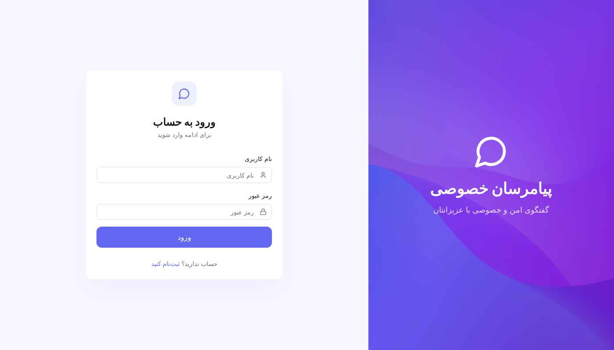
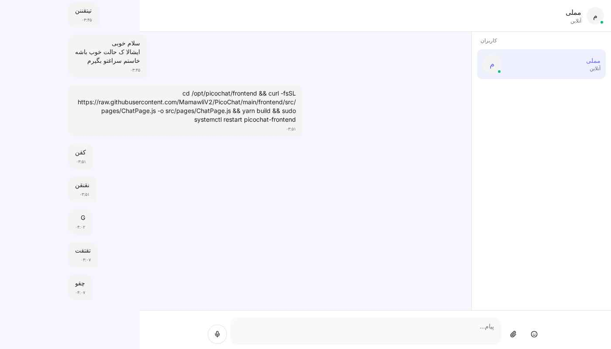
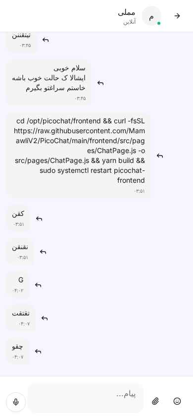
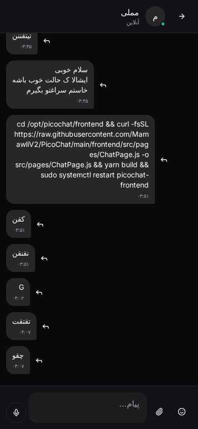

<div align="center">

# 💬 PicoChat


### پیامرسان خصوصی، امن و زیبا

یک پیامرسان مدرن و سبک برای گفتگوی خصوصی بین دو نفر

<br/>

[](https://python.org)
[](https://react.dev)
[](https://fastapi.tiangolo.com)
[](https://mongodb.com)
[](LICENSE)

<br/>

[ویژگی‌ها](#-ویژگیها) •
[نصب سریع](#-نصب-سریع) •
[اسکرین‌شات](#-اسکرینشات) •
[مستندات](#-مستندات-api) •
[مشارکت](#-مشارکت)

</div>

---

<br/>

## ✨ ویژگی‌ها

<table>
<tr>
<td width="50%" valign="top">

### 💬 پیام‌رسانی
- ✅ ارسال و دریافت پیام لحظه‌ای
- ✅ پشتیبانی از عکس و ویدیو
- ✅ ضبط و ارسال پیام صوتی
- ✅ پاسخ (Reply) به پیام‌ها
- ✅ انتخاب ایموجی 😊

</td>
<td width="50%" valign="top">

### 🎨 رابط کاربری
- ✅ طراحی مدرن و زیبا
- ✅ تم تاریک و روشن
- ✅ کاملاً ریسپانسیو (موبایل و دسکتاپ)
- ✅ پشتیبانی کامل از فارسی (RTL)
- ✅ انیمیشن‌های روان

</td>
</tr>
<tr>
<td width="50%" valign="top">

### 🔒 امنیت
- ✅ احراز هویت با JWT
- ✅ رمزنگاری پسورد با Bcrypt
- ✅ پشتیبانی از SSL/HTTPS
- ✅ اعتبارسنجی ورودی‌ها

</td>
<td width="50%" valign="top">

### ⚡ عملکرد
- ✅ ارتباط Real-time با WebSocket
- ✅ نمایش وضعیت آنلاین/آفلاین
- ✅ نمایش وضعیت پیام (ارسال/خوانده شده)
- ✅ نمایش "در حال تایپ..."

</td>
</tr>
</table>

<br/>

---

<br/>

## 📸 اسکرین‌شات

<br/>

### 🖥️ نسخه دسکتاپ

<div align="center">

| صفحه ورود | چت - تم روشن |
|:---------:|:------------:|
|  |  |

| چت - تم تاریک |
|:-------------:|
|  |

</div>

<br/>

### 📱 نسخه موبایل

<div align="center">

| صفحه ورود | لیست کاربران | چت - روشن | چت - تاریک |
|:---------:|:------------:|:---------:|:----------:|
|  |  |  |  |

</div>

<br/>

---

<br/>

## 🚀 نصب سریع

<br/>

### نصب خودکار (پیشنهادی)

فقط این دستور رو روی سرور Ubuntu/Debian اجرا کنید:

```bash
curl -fsSL https://raw.githubusercontent.com/MamawliV2/PicoChat/main/install.sh -o install.sh && chmod +x install.sh && sudo ./install.sh
```

<br/>

> 📝 اسکریپت به صورت تعاملی:
> - تمام پیش‌نیازها رو نصب می‌کنه
> - تنظیمات رو از شما می‌پرسه
> - در صورت نیاز SSL رایگان دریافت می‌کنه
> - سرویس‌ها رو راه‌اندازی می‌کنه

<br/>

### گزینه‌های اسکریپت

| دستور | توضیحات |
|:-----:|---------|
| `./install.sh` | نصب کامل |
| `./install.sh --help` | نمایش راهنما |
| `./install.sh --uninstall` | حذف کامل |

<br/>

---

<br/>

## 📋 پیش‌نیازها

<br/>

> 💡 اسکریپت نصب، تمام پیش‌نیازها رو به صورت خودکار نصب می‌کنه.

<br/>

| نرم‌افزار | نسخه |
|:---------:|:----:|
| Ubuntu/Debian | 20.04+ |
| Python | 3.10+ |
| Node.js | 20+ |
| MongoDB | 6.0+ |

<br/>

---

<br/>

## 🔧 نصب دستی

<br/>

<details>
<summary><strong>📖 کلیک کنید</strong></summary>

<br/>

### ۱. کلون پروژه

```bash
git clone https://github.com/MamawliV2/PicoChat.git
cd PicoChat
```

### ۲. تنظیم Backend

```bash
cd backend
python3 -m venv venv
source venv/bin/activate
pip install -r requirements.txt
```

فایل `.env`:
```env
MONGO_URL=mongodb://localhost:27017
DB_NAME=picochat
JWT_SECRET=your-secret-key-here
CORS_ORIGINS=*
```

### ۳. تنظیم Frontend

```bash
cd ../frontend
yarn install
```

فایل `.env`:
```env
REACT_APP_BACKEND_URL=http://localhost:8001
```

### ۴. اجرا

```bash
# Backend
cd backend && source venv/bin/activate
uvicorn server:app --host 0.0.0.0 --port 8001

# Frontend (ترمینال جدید)
cd frontend && yarn start
```

</details>

<br/>

---

<br/>

## 🐳 نصب با Docker

<br/>

<details>
<summary><strong>📖 کلیک کنید</strong></summary>

<br/>

```bash
git clone https://github.com/MamawliV2/PicoChat.git
cd PicoChat

export JWT_SECRET=$(openssl rand -hex 32)
docker-compose up -d
```

</details>

<br/>

---

<br/>

## 📡 مستندات API

<br/>

### 🔐 احراز هویت

| متد | مسیر | توضیحات |
|:---:|------|---------|
| `POST` | `/api/auth/register` | ثبت‌نام |
| `POST` | `/api/auth/login` | ورود |
| `GET` | `/api/auth/me` | اطلاعات کاربر |
| `POST` | `/api/auth/logout` | خروج |

<br/>

### 👥 کاربران

| متد | مسیر | توضیحات |
|:---:|------|---------|
| `GET` | `/api/users` | لیست کاربران |
| `GET` | `/api/users/{id}` | اطلاعات کاربر |

<br/>

### 💬 پیام‌ها

| متد | مسیر | توضیحات |
|:---:|------|---------|
| `GET` | `/api/messages/{conv_id}` | دریافت پیام‌ها |
| `POST` | `/api/messages/{conv_id}` | ارسال پیام |
| `POST` | `/api/upload/{conv_id}` | آپلود فایل |

<br/>

### 🔌 WebSocket

```
WS /ws/{token}
```

<br/>

---

<br/>

## 📁 ساختار پروژه

<br/>

```
PicoChat/
├── 📂 backend/
│   ├── server.py         # سرور FastAPI
│   ├── requirements.txt  # وابستگی‌ها
│   └── uploads/          # فایل‌های آپلود شده
│
├── 📂 frontend/
│   └── src/
│       ├── pages/        # صفحات
│       ├── components/   # کامپوننت‌ها
│       └── contexts/     # Context ها
│
├── 📂 docs/
│   └── screenshots/      # تصاویر
│
├── 📄 install.sh         # اسکریپت نصب
├── 📄 docker-compose.yml
├── 📄 LICENSE
└── 📄 README.md
```

<br/>

---

<br/>

## 🛠️ مدیریت سرویس

<br/>

```bash
# وضعیت
sudo systemctl status picochat-backend
sudo systemctl status picochat-frontend

# ری‌استارت
sudo systemctl restart picochat-backend picochat-frontend

# لاگ‌ها
sudo journalctl -u picochat-backend -f

# حذف کامل
sudo ./install.sh --uninstall
```

<br/>

---

<br/>

## 🤝 مشارکت

<br/>

از مشارکت شما استقبال می‌کنیم!

1. 🍴 Fork کنید
2. 🌿 Branch بسازید: `git checkout -b feature/amazing`
3. 💾 Commit کنید: `git commit -m 'Add feature'`
4. 📤 Push کنید: `git push origin feature/amazing`
5. 🔃 Pull Request بسازید

<br/>

---

<br/>

## 📄 لایسنس

<br/>

این پروژه تحت لایسنس **MIT** منتشر شده است.

<br/>

---

<br/>

## 📞 ارتباط

<br/>

<div align="center">

[](mailto:shabgard.ao@gmail.com)
[](https://t.me/DZ_CT)
[](https://github.com/MamawliV2)

</div>

<br/>

---

<br/>

<div align="center">

### ⭐ اگر این پروژه رو دوست داشتید، بهش ستاره بدید!

<br/>

ساخته شده با ❤️ در ایران

<br/>

[🔝 برگشت به بالا](#-picochat)

</div>
